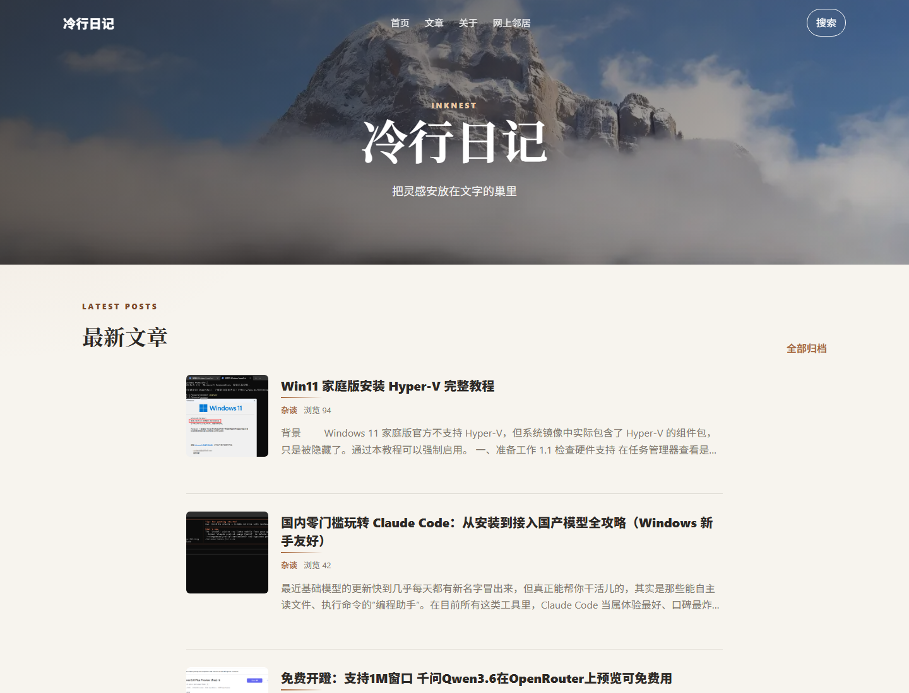

# Halo Theme InkNest

InkNest 是一款为 Halo 2 打造的内容型博客主题，主打大图 Banner、经典文章列表和沉浸式阅读体验，适合个人博客、知识沉淀、随笔记录和内容归档站点。

## 特性

- 大图 Banner 与遮罩展示，默认图提供 WebP 优化版本，根目录截图可用于主题商店展示
- 经典文章列表布局，突出发布时间、标题、摘要、分类和标签
- 文章页目录、阅读进度、代码复制、图片灯箱、真实作者信息、转载说明和上一篇 / 下一篇
- Skip link、焦点管理、降低动态效果和 404 可读导航等可访问性优化
- 搜索插件入口、移动菜单、返回顶部和 `/` 搜索快捷键
- 分类、标签、归档、作者页、404 页面适配
- 友情链接页，支持 Halo 链接插件
- 页脚社交链接、快捷链接、友情链接、ICP 备案和公安联网备案展示
- Open Graph、Twitter Card、canonical、robots、文章分类 / 标签元信息、文章结构化数据、面包屑结构化数据、RSS alternate 和主题色等 SEO 元信息
- 自定义 Head、CSS、JavaScript 和 Footer 代码

## 安装

1. 将 `Halo-InkNest` 放入 Halo 的 `themes` 目录，或在 Halo 控制台上传发布包 `theme-inknest-1.0.0.zip`。
2. 在 Halo 控制台启用 `InkNest`。
3. 在主题设置中配置 Logo、全局 Banner、菜单、文章列表样式、文章详情、页脚、社交链接和自定义代码。

## 插件兼容

- 搜索：使用 Halo 搜索组件 / 搜索插件（`PluginSearchWidget`），启用插件后主题会显示搜索入口。
- 评论：使用 Halo 评论组件，需站点已启用评论能力。
- 友情链接：`/links` 页面和页脚友情链接读取 Halo 链接插件数据。
- 图片灯箱：开启后仅在正文包含图片时按需加载 Fancybox 资源。

## 配置建议

- 全局 Banner 建议使用横向图片，宽度 1600px 以上；默认 Banner 已提供 WebP 优化版本。
- 文章列表左侧可选择日期块、封面图或自动模式；默认日期块适合文字型博客首页。
- 社交链接选择“邮箱”平台时，只填写邮箱地址，不要填写 `mailto:`。
- 页脚友情链接支持显示开关和每组显示数量限制，链接很多时建议限制数量。
- 自定义 JavaScript 会在 DOMContentLoaded 后执行；自定义代码仅建议可信站点管理员使用。

## 上架信息

- 应用类型：主题
- 应用名称：InkNest
- 版本号：`1.0.0`
- Halo 兼容范围：`>=2.25.0`
- 许可证：GPL-3.0
- 主页：https://github.com/motao123/Halo-Inknest
- 问题反馈：https://github.com/motao123/Halo-Inknest/issues
- 开源仓库：https://github.com/motao123/Halo-Inknest
- 发布制品：`theme-inknest-1.0.0.zip`

## 首次上架自查

- `theme.yaml` 已设置 `homepage`、`repo`、`issues`、`license`、`requires` 和 `version`。
- README 已包含介绍、安装方式、插件兼容、配置建议、许可证和反馈地址。
- 根目录 `screenshot.png` 可作为应用市场截图和 README 展示图。
- 主题不包含数据采集、远程执行、恶意代码或隐藏的第三方服务调用。
- 自定义 Head、CSS、JavaScript 和 Footer 代码仅由站点管理员在后台配置后输出。

## 版本说明

### 1.0.0

- 首次发布 InkNest 主题。
- 提供首页、文章、页面、分类、标签、归档、作者、友情链接和 404 页面模板。
- 支持搜索插件入口、评论组件、友情链接插件、图片灯箱、代码复制、阅读进度和 SEO 元信息。

## 兼容性

- Halo：`>= 2.25.0`
- 模板引擎：Thymeleaf

## License

GPL-3.0
